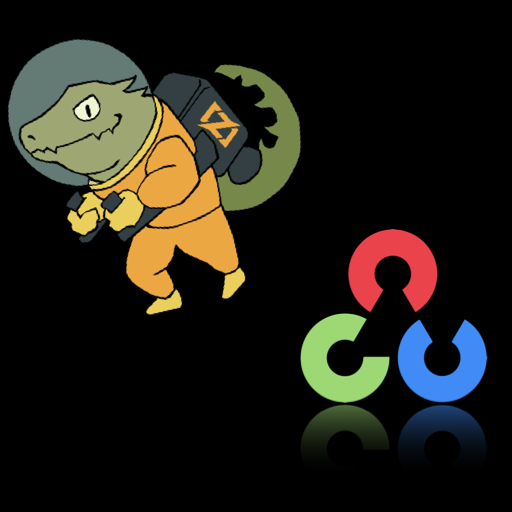

# ZIGCV

[](https://github.com/ryoppippi/zigcv/actions/workflows/ci.yml)

<div align="center">
  
</div>

The ZIGCV library provides Zig language bindings for the [OpenCV 4](http://opencv.org/) computer vision library.

The ZIGCV library supports the head/master of zig and OpenCV (v4.6.0) on Linux, macOS, and Windows.

## Caution

Still under development, so the zig APIs will be dynamically changed.

You can use `const c_api = @import("zigcv").c_api;` to call c bindings directly.  
This C-API is currently fixed.

## How to execute

### Use your own package manager
At first, install openCV 4.6. (maybe you can read how to install from [here](https://github.com/hybridgroup/gocv#how-to-install)).  
Then:

```sh
git clone --recursive https://github.com/ryoppippi/zigcv
cd zigcv
zig build
```

Currently this repo works with zig 0.11.0, so make sure you have it installed.
We are working on updating to zig 0.12.0.


### Use devenv (recommended)
We also provide a [devenv](https://devenv.sh) environment powered by Nix that bundles Zig 0.11.0, the latest [ZLS](https://github.com/zigtools/zls) release, OpenCV 4.6.0, pkg-config, and pre-fetched DNN model assets.

```sh
nix profile install github:cachix/devenv/latest
git clone --recursive https://github.com/ryoppippi/zigcv
cd zigcv
devenv shell
# inside the shell
build
test
```

Inside the shell you'll find helper commands such as `build`, `test`, `fmt`, `fmt-check`, and `download-models`. See [devenv.nix](./devenv.nix) for more details.
`download-models` syncs the pinned model corpus from the Nix store into `zig-cache/tmp`, so the heavier DNN tests can run without hitting the network.

## Demos

you can build some demos.
For example:

```sh
zig build examples
./zig-out/bin/face_detection 0
```

Or you can run the demo from the devenv shell:

```sh
devenv shell
# inside the shell
build examples
./zig-out/bin/face_detection 0
```

<div align="center">
  
</div>

You can see the full demo list by `zig build --help`.

## Technical restrictions

Due to zig being a relatively new language it does [not have full C ABI support](https://github.com/ziglang/zig/issues/1481) at the moment.  
For use that mainly means we can't use any functions that return structs that are less than 16 bytes large on x86, and passing structs to any functions may cause memory error on arm.

## Sponsors

<p align="center">
	<a href="https://github.com/sponsors/ryoppippi">
		
	</a>
</p>

## License

MIT

## Author

Ryotaro "Justin" Kimura (a.k.a. ryoppippi)
